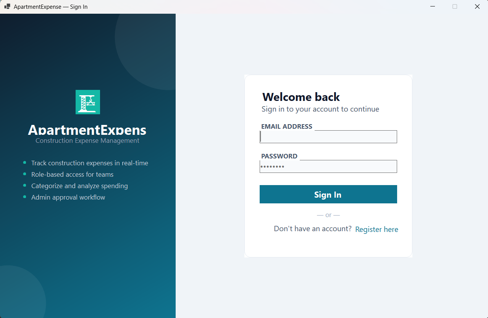
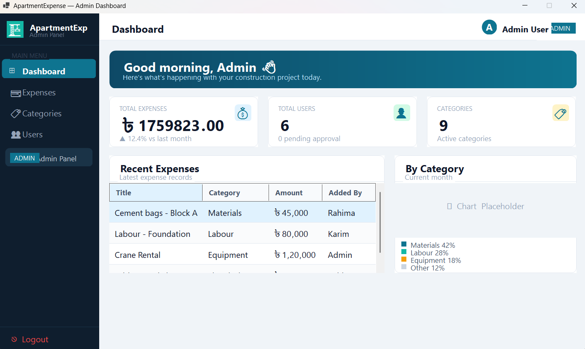
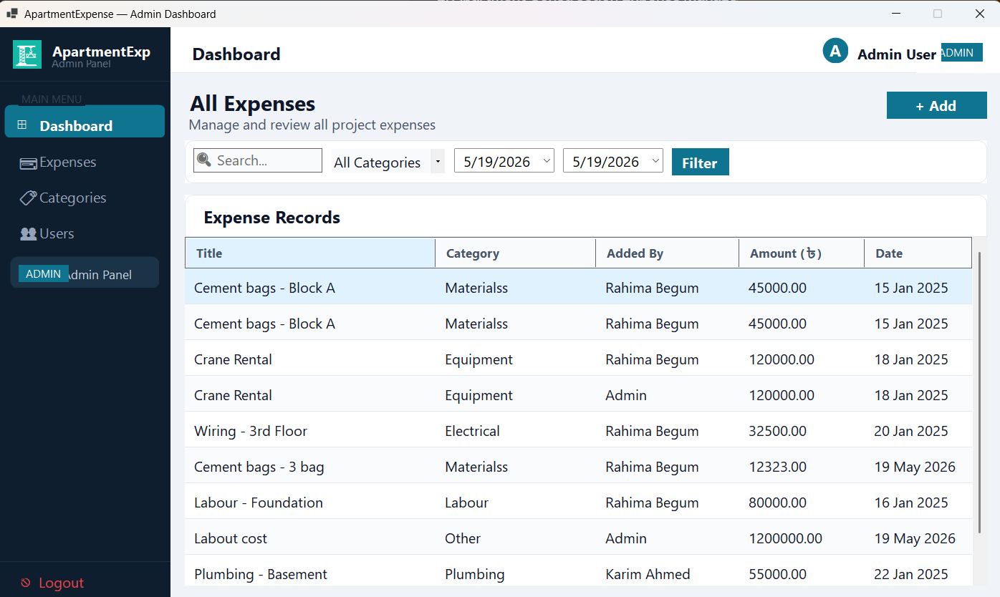
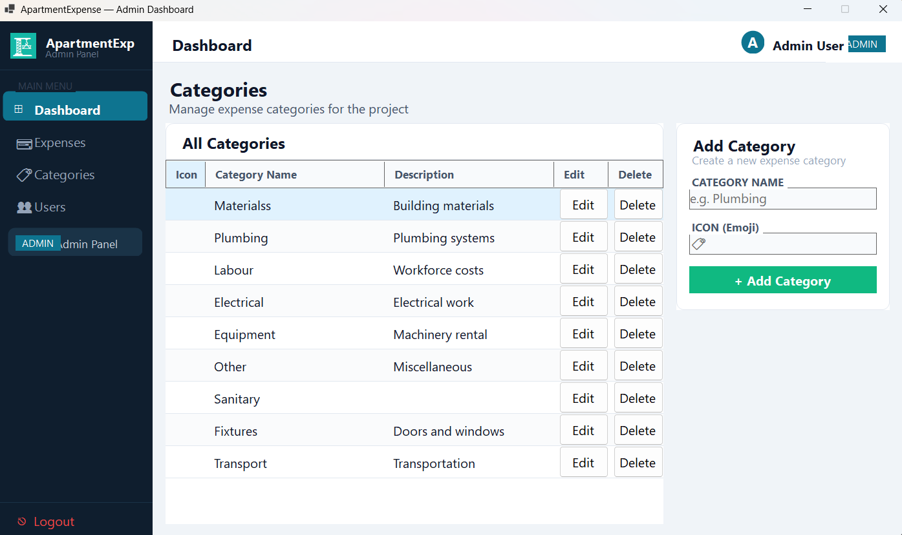
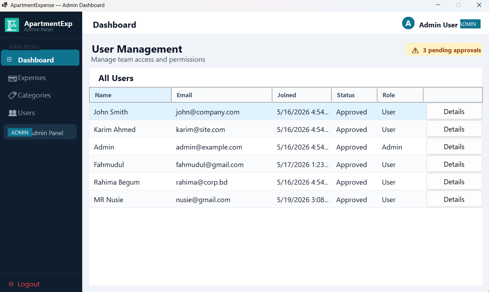
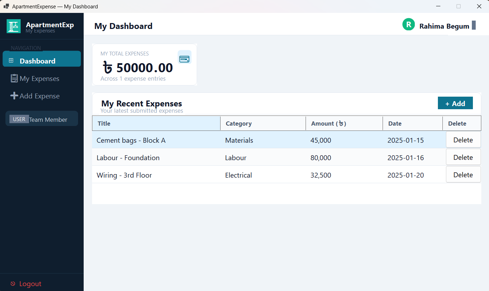

# 🏗️ Apartment Construction Expense Management System

A desktop application built with **C# Windows Forms (.NET 10)** for managing construction project expenses. The system supports role-based access for admins and team members, with a full approval workflow and real-time expense tracking.

> **Course:** Object Oriented Programming 2 (OOP2)
> **University:** American International University-Bangladesh (AIUB)
> **Supervisor:** Zishan Ahmed Onik

---

## 👥 Team Members

| Name | Student ID | Contribution |
|------|-----------|-------------|
| Fahmudul Hassan Siam *(Team Leader)* | 24-58097-2 | Project skeleton, database setup, helper utilities, category management, user service, authentication (partial) |
| Sabuj Kumar Paul | 24-59609-3 | Expense management (add, view, delete), user and admin both can see recent expenses |
| Padmasree Saha | 24-59331-3 | Authentication service (login, register, approval workflow) |
| Progma Hossain | 23-51944-2 | Dashboard statistics, expense views for both admin and user |

---

## ✨ Features

### 🔐 Authentication & Access Control
- User registration with admin approval workflow
- Role-based login — Admin and User roles
- Pending users cannot login until approved by admin
- Approval pending modal shown after registration

### 👑 Admin Panel
- **Dashboard** — Total expenses, total users, active categories, recent expense table
- **User Management** — View all users, approve/reject/block/unblock with role-aware actions
- **Category Management** — Create, edit, delete expense categories with emoji icons
- **Expense Management** — View all project expenses across all users

### 👤 User Panel
- **Dashboard** — Personal total expenses and expense count stats
- **My Expenses** — View, add and delete personal expenses
- **Add Expense** — Dynamic category dropdown loaded from database

---

## 🛠️ Tech Stack

| Layer | Technology |
|-------|-----------|
| Language | C# (.NET 10) |
| UI Framework | Windows Forms (WinForms) |
| Database | SQL Server Express (local) |
| ORM | Raw SQL with `Microsoft.Data.SqlClient` |
| Environment | `DotNetEnv` for `.env` file support |
| IDE | Visual Studio 2022+ |

---

## 📸 Screenshots

### Sign In


### Admin Dashboard


### Expense Management


### Category Management


### User Management


### User Dashboard


---

## 🗄️ Database Schema

```sql
Users (
    UserID       UNIQUEIDENTIFIER PRIMARY KEY DEFAULT NEWID(),
    Name         NVARCHAR(100)  NOT NULL,
    Email        NVARCHAR(150)  NOT NULL UNIQUE,
    Password     NVARCHAR(255)  NOT NULL,
    Role         NVARCHAR(10)   NOT NULL DEFAULT 'User'   -- 'Admin' | 'User'
    Status       NVARCHAR(10)   NOT NULL DEFAULT 'Pending' -- 'Pending' | 'Approved' | 'Blocked'
    JoinedAt     DATETIME       NOT NULL DEFAULT GETDATE()
)

Categories (
    CategoryID   UNIQUEIDENTIFIER PRIMARY KEY DEFAULT NEWID(),
    CategoryName NVARCHAR(100)  NOT NULL UNIQUE,
    Icon         NVARCHAR(10)   NOT NULL DEFAULT '🏷',
    Description  NVARCHAR(255)  NULL
)

Expenses (
    ExpenseID    UNIQUEIDENTIFIER PRIMARY KEY DEFAULT NEWID(),
    Title        NVARCHAR(200)  NOT NULL,
    Amount       DECIMAL(18,2)  NOT NULL,
    ExpenseDate  DATE           NOT NULL,
    CategoryID   UNIQUEIDENTIFIER NOT NULL REFERENCES Categories(CategoryID),
    UserID       UNIQUEIDENTIFIER NOT NULL REFERENCES Users(UserID),
    CreatedAt    DATETIME       NOT NULL DEFAULT GETDATE()
)
```

---

## 🚀 Getting Started

### Prerequisites

- Windows 10 or later
- [.NET 10 SDK](https://dotnet.microsoft.com/download)
- [SQL Server Express](https://www.microsoft.com/en-us/sql-server/sql-server-downloads)
- [Visual Studio 2022+](https://visualstudio.microsoft.com/) or any C# IDE
- Internet connection (for NuGet package restore)

---

### Step 1 — Clone the Repository

```bash
git clone https://github.com/your-repo/Apartment-Construction-Expense-Management-System.git
cd Apartment-Construction-Expense-Management-System
```

---

### Step 2 — Set Up the Database

Open **SSMS** or **Visual Studio Query Window**, connect to `localhost\SQLEXPRESS` and run:

```sql
CREATE DATABASE ApartmentExpenseDB;
GO

USE ApartmentExpenseDB;
GO

CREATE TABLE Users (
    UserID   UNIQUEIDENTIFIER PRIMARY KEY DEFAULT NEWID(),
    Name     NVARCHAR(100) NOT NULL,
    Email    NVARCHAR(150) NOT NULL UNIQUE,
    Password NVARCHAR(255) NOT NULL,
    Role     NVARCHAR(10)  NOT NULL DEFAULT 'User'
             CHECK (Role IN ('Admin', 'User')),
    Status   NVARCHAR(10)  NOT NULL DEFAULT 'Pending'
             CHECK (Status IN ('Pending', 'Approved', 'Blocked')),
    JoinedAt DATETIME      NOT NULL DEFAULT GETDATE()
);
GO

CREATE TABLE Categories (
    CategoryID   UNIQUEIDENTIFIER PRIMARY KEY DEFAULT NEWID(),
    CategoryName NVARCHAR(100) NOT NULL UNIQUE,
    Icon         NVARCHAR(10)  NOT NULL DEFAULT '🏷',
    Description  NVARCHAR(255) NULL
);
GO

CREATE TABLE Expenses (
    ExpenseID   UNIQUEIDENTIFIER PRIMARY KEY DEFAULT NEWID(),
    Title       NVARCHAR(200)  NOT NULL,
    Amount      DECIMAL(18,2)  NOT NULL CHECK (Amount > 0),
    ExpenseDate DATE           NOT NULL,
    CategoryID  UNIQUEIDENTIFIER NOT NULL
                FOREIGN KEY REFERENCES Categories(CategoryID),
    UserID      UNIQUEIDENTIFIER NOT NULL
                FOREIGN KEY REFERENCES Users(UserID),
    CreatedAt   DATETIME NOT NULL DEFAULT GETDATE()
);
GO

-- Default Admin
INSERT INTO Users (Name, Email, Password, Role, Status)
VALUES ('Admin', 'admin@example.com', 'admin123', 'Admin', 'Approved');
GO

-- Default User
INSERT INTO Users (Name, Email, Password, Role, Status)
VALUES ('Test User', 'user@example.com', 'user123', 'User', 'Approved');
GO

-- Categories
INSERT INTO Categories (CategoryName, Icon, Description) VALUES
('Materials',  '🧱', 'Building materials'),
('Labour',     '👷', 'Workforce costs'),
('Equipment',  '🔧', 'Machinery rental'),
('Electrical', '⚡', 'Electrical work'),
('Fixtures',   '🪟', 'Doors and windows'),
('Plumbing',   '🚿', 'Plumbing systems'),
('Transport',  '🚛', 'Transportation'),
('Other',      '📋', 'Miscellaneous');
GO
```

---

### Step 3 — Configure Environment Variables

Copy `.env.example` to `.env`:

```bash
copy .env.example .env
```

Open `.env` and fill in your values:

```env
ENVIRONMENT=development

DB_SERVER_DEV=localhost\SQLEXPRESS
DB_NAME_DEV=ApartmentExpenseDB
```

> ⚠️ Never push `.env` to GitHub. It is already in `.gitignore`.

---

### Step 4 — Run the Project

```bash
dotnet restore
dotnet run
```

---

## 🔑 Default Login Credentials

| Role | Email | Password |
|------|-------|----------|
| Admin | admin@example.com | admin123 |
| User | user@example.com | user123 |

---

## 📁 Project Structure

```
ApartmentWinForms/
├── Controls/
│   └── SidebarButton.cs          # Custom sidebar navigation button
├── Forms/                         # All UI screens
│   ├── LoginForm.cs/.Designer.cs
│   ├── RegisterForm.cs/.Designer.cs
│   ├── PendingApprovalForm.cs/.Designer.cs
│   ├── AdminDashboardForm.cs/.Designer.cs
│   ├── AdminExpensesForm.cs/.Designer.cs
│   ├── AdminCategoriesForm.cs/.Designer.cs
│   ├── AdminUsersForm.cs/.Designer.cs
│   ├── UserDashboardForm.cs/.Designer.cs
│   ├── UserExpensesForm.cs/.Designer.cs
│   ├── AddExpenseForm.cs/.Designer.cs
│   ├── EditCategoryForm.cs/.Designer.cs
│   └── UserDetailsForm.cs/.Designer.cs
├── Helpers/
│   ├── UITheme.cs                 # Design system — colors, fonts, factory methods
│   └── DatabaseHelper.cs         # SQL connection with dev/prod environment switching
├── Models/
│   ├── User.cs
│   ├── Category.cs
│   └── Expense.cs
├── Services/
│   ├── AuthService.cs             # Login, register, session management
│   ├── CategoryService.cs         # Category CRUD
│   ├── ExpenseService.cs          # Expense CRUD and queries
│   └── UserService.cs             # User status management
├── .env                           # Local config — not on GitHub
├── .env.example                   # Template for teammates
├── .gitignore
├── Program.cs
└── ApartmentWinForms.csproj
```

---

## ⚠️ Known Limitations

- Passwords are stored as plain text — no hashing implemented yet
- Expense filtering (search, date range, category) UI exists but logic not yet connected
- No chart/graph rendering — chart section shows placeholder
- No edit functionality for expenses yet

---

## 📄 License

This project is developed for academic purposes at AIUB under the OOP2 course.
